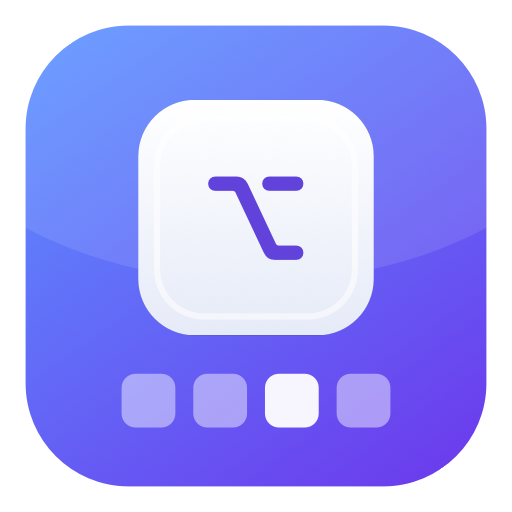
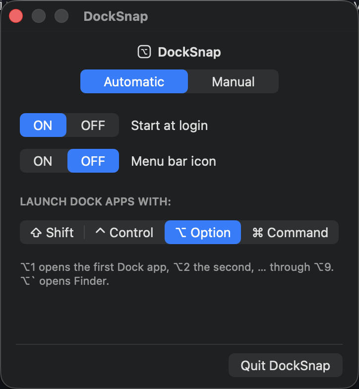
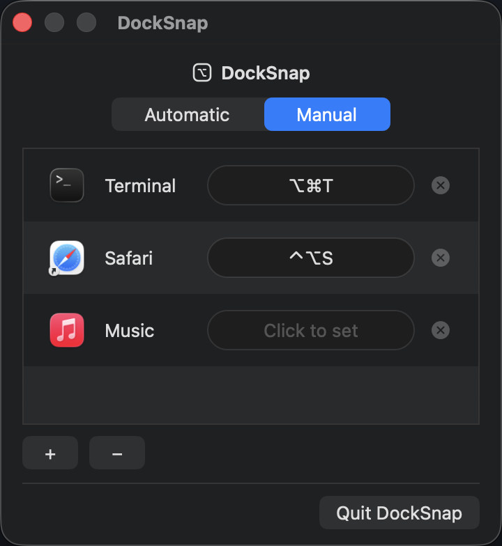

<div align="center">



# DockSnap

**Launch and switch to your Dock apps with a keystroke.**

A tiny, native macOS menu-bar app that turns <kbd>⌥</kbd>+<kbd>1…9</kbd> into instant
shortcuts for the apps in your Dock — plus your own custom shortcuts for any app.


</div>

---

## ✨ What it does

DockSnap maps keyboard shortcuts to your Dock so your hands never leave the keyboard:

- **⌥ + number → Dock app.** Hold <kbd>⌥</kbd> (Option) and press <kbd>1</kbd>–<kbd>9</kbd>
  to launch or focus the 1st–9th app in your Dock. Already running? It comes to the front.
- **⌥ + ` → Finder.** A dedicated shortcut for the one app everyone needs.
- **Pick your own modifier.** Prefer <kbd>⌃⌥</kbd> or <kbd>⌘⌥</kbd>? Choose any modifier
  combination in Settings — DockSnap only fires on that exact combo, so your normal
  typing is never touched.
- **Custom per-app shortcuts.** Assign a personal shortcut (e.g. <kbd>⌘⌥T</kbd> → Terminal)
  to any app. Manual shortcuts always take priority over the automatic ones.
- **Lives in the menu bar.** No Dock clutter, no window — just a small icon with a popover.
- **Start at login.** One toggle, powered by the modern `SMAppService` API.

> DockSnap is **safe by design**: it watches keystrokes through a macOS event tap, but
> only ever *consumes* your chosen shortcut combos. Every other key passes straight
> through. If you revoke Accessibility permission, the hook removes itself instantly and
> your keyboard behaves completely normally.

---

## 🖼️ Screenshots

DockSnap lives quietly in your menu bar. Click its icon to open Settings — two tabs cover everything:

| **Automatic** — pick a modifier, then ⌥1–9 hit your Dock | **Manual** — bind a custom shortcut to any app |
|:---:|:---:|
|  |  |

---

## 📋 Requirements

- **macOS 13 (Ventura) or later**
- **Xcode Command Line Tools** (provides the Swift toolchain):
  ```sh
  xcode-select --install
  ```

---

## 🚀 Installation

Clone the repo and run a single command:

```sh
git clone https://github.com/RollerSweet/dock-snap.git
cd dock-snap
make install
```

`make install` will:

1. Build DockSnap in release mode.
2. Create a **stable self-signed code-signing identity** (one time only). This keeps your
   Accessibility permission across future reinstalls and updates.
3. Install the app bundle to `~/Applications/DockSnap.app`, sign it, and launch it.

### First-run setup (once)

macOS needs your permission for DockSnap to read keyboard shortcuts. On first launch
you'll be prompted — or grant it manually:

**System Settings → Privacy & Security → Accessibility → enable _DockSnap_.**

That's it. Thanks to the stable signing identity, you won't have to grant this again on
future `make install` runs.

---

## 🎮 Usage

1. Click the **DockSnap icon** in your menu bar to open Settings.
2. **Automatic tab** — pick the modifier combo (default <kbd>⌥</kbd>), toggle *Start at
   login*, and toggle the menu-bar icon.
3. **Manual tab** — add an app and record a custom shortcut for it.
4. Try it: hold <kbd>⌥</kbd> and tap <kbd>1</kbd> — the first app in your Dock jumps to
   the front.

The Dock mapping updates automatically as you rearrange your Dock.

---

## 🔄 Updating

Pull the latest changes and reinstall:

```sh
git pull
make install
```

Your settings and Accessibility permission are preserved.

---

## 🗑️ Uninstalling

```sh
make uninstall
```

This stops DockSnap and removes `~/Applications/DockSnap.app`. If you had *Start at login*
enabled, also remove it under **System Settings → General → Login Items**.

To fully clean up the saved Accessibility permission, remove the DockSnap entry under
**System Settings → Privacy & Security → Accessibility**.

---

## 🛠️ Make targets

| Command          | What it does                                                        |
|------------------|---------------------------------------------------------------------|
| `make build`     | Build the release binary (`.build/release/DockSnap`).               |
| `make run`       | Build and run the binary directly (no bundle, no login item).       |
| `make install`   | Build, sign, install to `~/Applications`, and launch.               |
| `make uninstall` | Stop and remove the installed app.                                  |
| `make start`     | Open the installed app.                                             |
| `make stop`      | Quit the running app.                                               |
| `make cert`      | Create the self-signed signing identity (idempotent).               |
| `make logs`      | Tail the runtime log at `/tmp/docksnap.log`.                        |
| `make reseticons`| Force macOS to refresh the app's icon cache.                        |

---

## 🧱 How it works

DockSnap is a small AppKit application (no storyboards, pure code):

- **`HotkeyEngine`** installs a `CGEvent` keyboard tap, matches your configured shortcuts,
  and activates the matching app. The Dock app list is cached and refreshed on a
  background queue, so the keyboard hook never blocks.
- **`DockReader`** reads the current Dock layout.
- **`Settings`** persists your modifier combo, login-item and menu-bar preferences, and
  manual shortcuts to `UserDefaults`.
- **`SettingsViewController`** is the popover UI (Automatic / Manual tabs).
- The app runs as a menu-bar accessory (`LSUIElement`) with no Dock tile.

```
Sources/
├── main.swift                  # entry point
├── AppDelegate.swift           # menu bar, popover, login item
├── HotkeyEngine.swift          # event tap + shortcut matching
├── DockReader.swift            # reads the Dock layout
├── Settings.swift              # persisted preferences & models
├── SettingsViewController.swift# popover UI
├── ShortcutRecorderField.swift # records custom shortcuts
├── ManualRowView.swift         # a row in the Manual tab
├── KeyCodeMap.swift            # keycode → label
└── Logging.swift               # /tmp/docksnap.log
```

---

## ❓ Troubleshooting

- **Shortcuts do nothing.** Confirm DockSnap is enabled under *Privacy & Security →
  Accessibility*. Check `make logs` for `Event tap created successfully`.
- **Option-number types special characters instead.** That means the tap isn't active —
  re-check the Accessibility permission above.
- **Wrong app launches.** The mapping follows your Dock left-to-right; rearrange the Dock
  and it updates within a couple of seconds.
- **Icon looks stale after install.** Run `make reseticons`.

---

## 📄 License

**Proprietary — Copyright © 2026 Tamir Madar. All Rights Reserved.**

This source is published for viewing and personal evaluation only. You may **not** copy,
modify, redistribute, or use it commercially without written permission. See
[`LICENSE`](LICENSE) for the full terms.

For licensing inquiries: **tamirmadar5@gmail.com**
